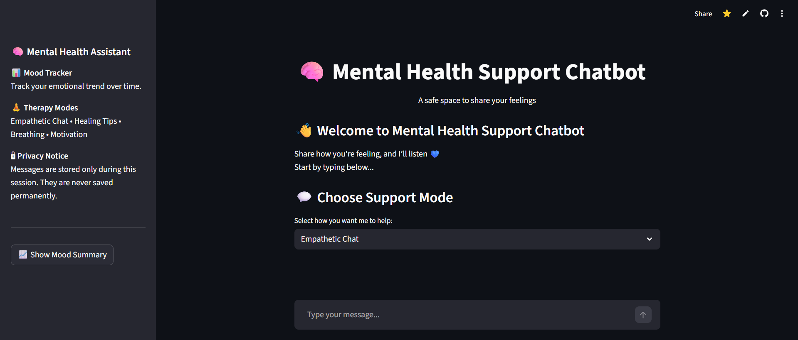

# 🧠 Mental Health Support Chatbot

A cloud-based AI-powered Mental Health Assistant built using **Streamlit** and **LLaMA 3.1 (HuggingFace Inference API)**.  
The application provides empathetic conversations, guided therapy exercises, emotion detection, and mood tracking visualization — all in real time.

🌐 **Live App:**  
https://mental--health--chatbot.streamlit.app/

---

## 🖼️ App Preview




## ✨ Features

- Empathetic AI Chat – LLaMA 3.1 responds with supportive and caring replies  
- Therapy Modes: Empathetic Chat, Healing Tips, Breathing Exercise, Motivation  
- Emotion Detection – Detects Anxiety, Sadness, Anger, Happiness, Fatigue  
- Sentiment Analysis – Polarity tracking using TextBlob  
- Mood Tracker – Visualizes emotional trends over time  
- Coping Tips – Personalized wellness suggestions  
- Crisis Detection – Detects high-risk phrases and shows emergency resources  
- Privacy First – Messages stored only during session and never saved permanently.

---

## 🛠️ Tech Stack

- Frontend: Streamlit  
- LLM: LLaMA-3.1 via HuggingFace Inference API  
- Sentiment: TextBlob  
- Visualization: Matplotlib  
- Backend: Python  
- Deployment: Streamlit Community Cloud  

---

## 🚀 Run Locally

### 1. Clone the repository

```bash
git clone https://github.com/AnshikaJain-code/Mental-Health-ChatBot.git
cd Mental-Health-ChatBot
```

### 2. Install dependencies

```bash
pip install -r requirements.txt
```

Add inside:

```bash
HF_TOKEN = "your_huggingface_access_token"
```

### 4. Run the app

```bash
streamlit run app.py
```

App runs at:

```bash
http://localhost:8501
```

## 🔐 HuggingFace Token Setup
  1. Create account at https://huggingface.co
  2. Settings → Access Tokens
  3. Generate token with Inference permission
  4. Paste in .streamlit/secrets.toml

## 👩‍💻 Author

Anshika Jain

GitHub: https://github.com/AnshikaJain-code 

## ⚠️ Disclaimer

This project is created for **educational and demonstration purposes only**.  
It is **not a substitute for professional medical or psychological treatment**.  
If you are facing severe mental health issues, please contact a licensed professional.
